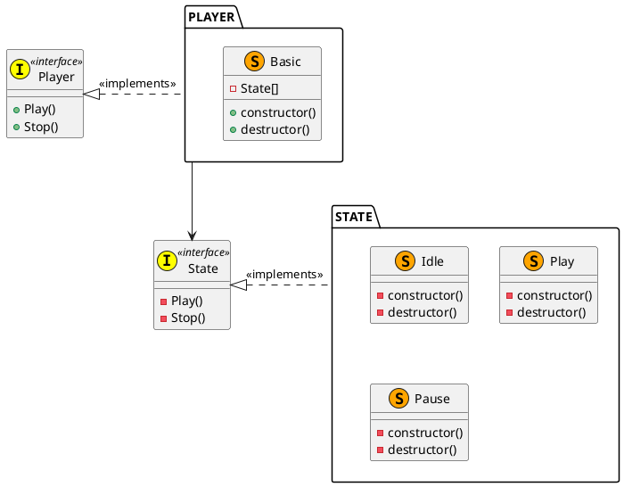
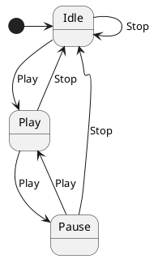

# CD Player

+ Dependencies: `none`
+ Includes: `player.h`


## How to build

```
$ git clone https://github.com/kaorukakinuma/cd-player.git
$ cd cd-player
$ sudo ./mk.sh
#snip
$ ls /home/lib
libplayer.a
$ ls /home/include
player.h
```


## How to run a test

```
$ ./test/run.sh
```

---


## Design





## Usage

```c
#include <basic_player.h>
#include <player.h>

int main( void )
{
    // create instance
    Player *pPlayer = __new__BasicPlayer();

    // play
    pPlayer->Play( pPlayer );

    // pause
    pPlayer->Play( pPlayer );

    // idle
    pPlayer->Stop( pPlayer );

    // destroy instance
    pPlayer = __del__BasicPlayer( pPlayer );

    return 0;
}
```
